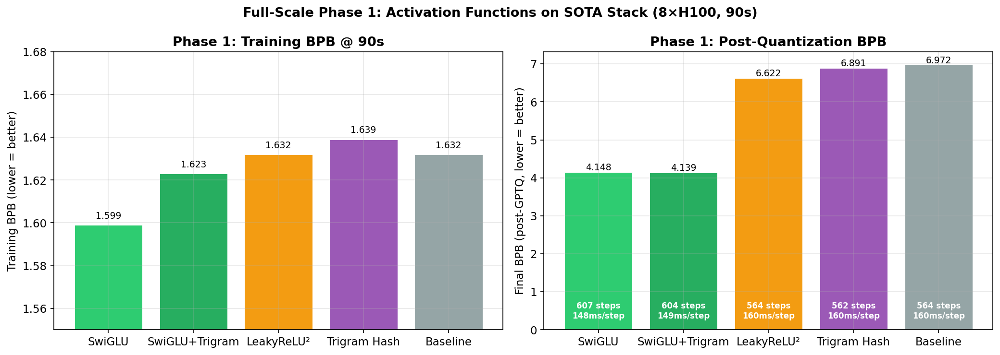
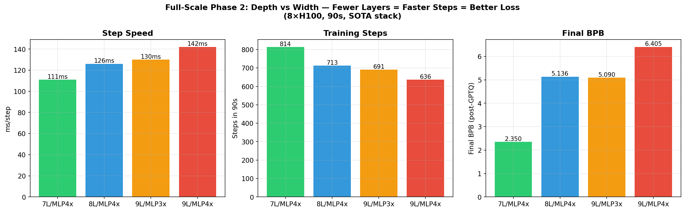
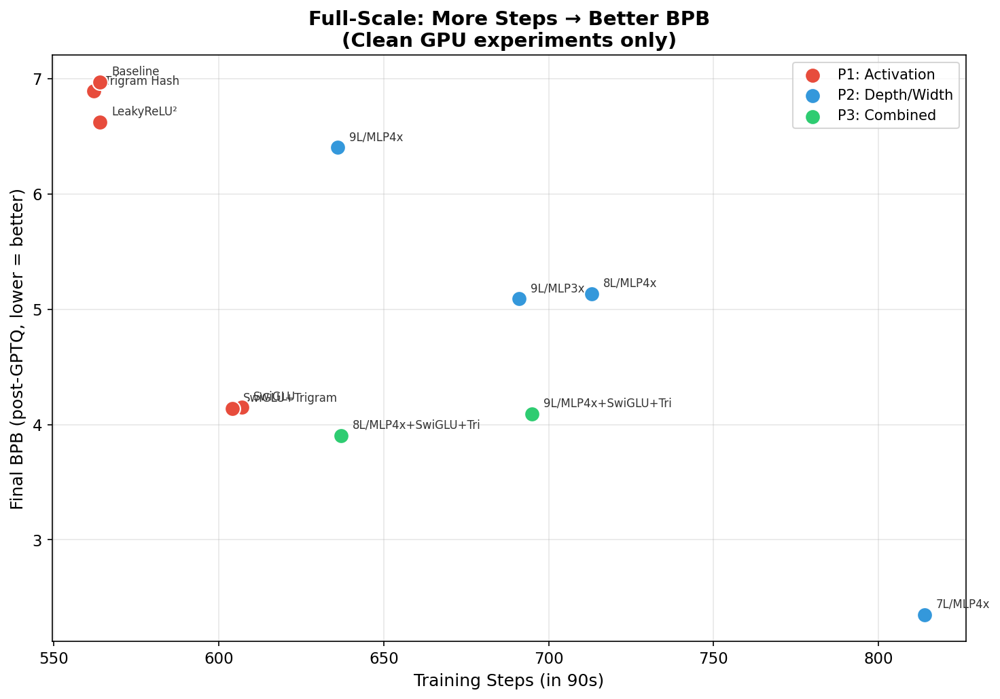
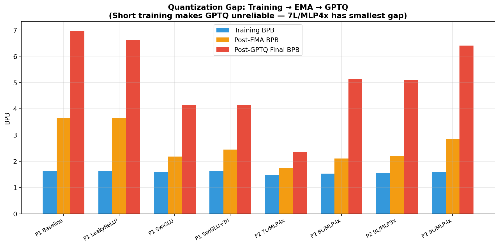
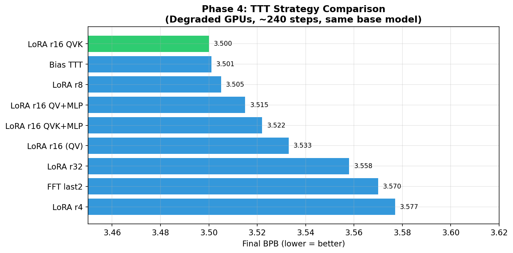
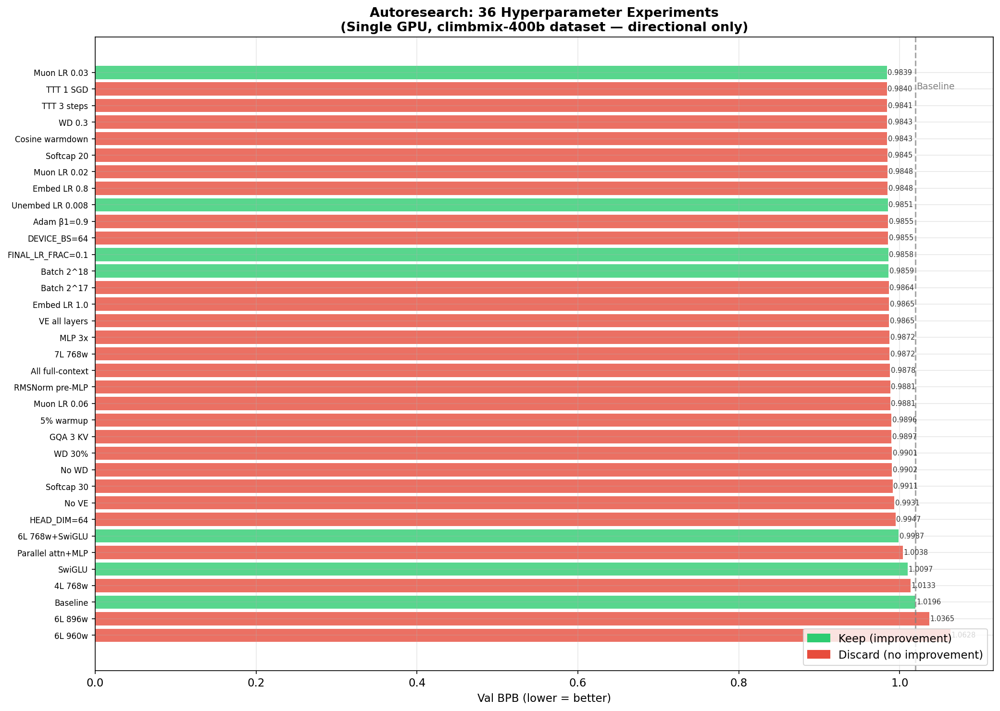
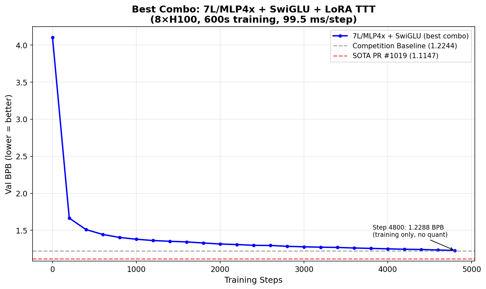
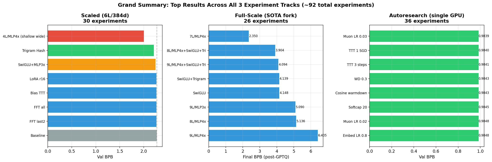
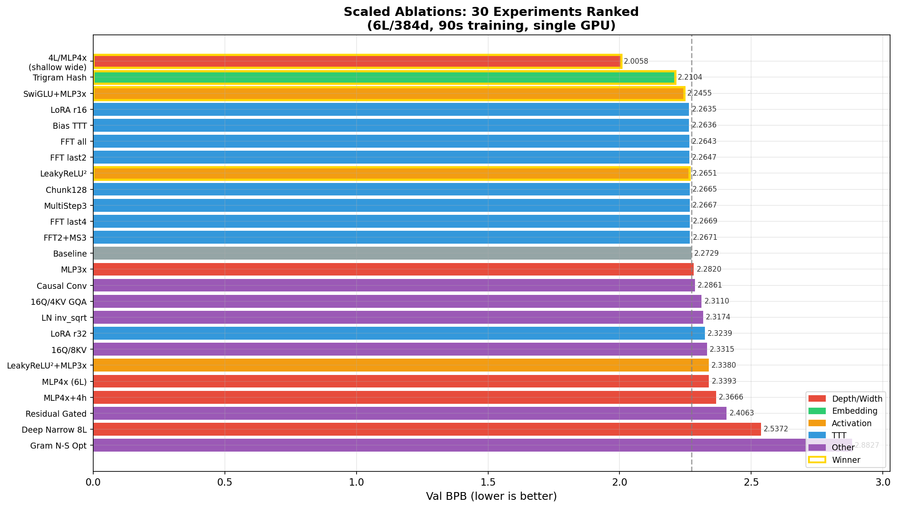

# Experiment Report: Parameter Golf Ablation Study

> **Ishan Sinha** — April 2026
> ~92 experiments across 3 tracks

---

## Overview

**Goal:** Beat SOTA of 1.1147 val_bpb (PR #1019) under competition constraints (10 min training, 16MB artifact, 8×H100).

**Approach:** Three experiment tracks, ~92 total experiments:
1. **Scaled ablations** — 30 experiments, 6L/384d model, 90s/run on 1 GPU
2. **Full-scale SOTA fork** — 26 experiments, 11L/512d SOTA base (`train_sota_exp.py`), 90s/run on 8×H100
3. **Autoresearch sweep** — 36 automated experiments, single GPU, hyperparameter grid search

---

## Key Findings

### 1. SwiGLU > LeakyReLU² (confirmed across all 3 tracks)

SwiGLU consistently beats LeakyReLU² and ReLU² across every experimental setup. On the SOTA fork it's both **8% faster** (148ms vs 160ms/step) and produces better loss. This is the single most robust finding.

| Track | SwiGLU BPB | LeakyReLU² BPB | Baseline BPB |
|-------|-----------|----------------|-------------|
| Scaled | 2.2455 | 2.2651 | 2.2729 |
| Full-scale | 4.148 | 6.622 | 6.972 |
| Autoresearch | 1.0097 | — | 1.0196 |

### 2. Width beats depth at fixed wall-clock

Trading layers for wider MLPs was the biggest single improvement, across both scaled and full-scale experiments. The mechanism: fewer layers = faster steps = more training steps in the same budget.

| Config | Steps in 90s | Training BPB | Post-GPTQ BPB |
|--------|-------------|-------------|---------------|
| **7L/MLP4x** | **814** | **1.489** | **2.350** |
| 8L/MLP4x | 713 | 1.534 | 5.136 |
| 9L/MLP3x | 691 | 1.546 | 5.090 |
| 11L baseline | 564 | 1.632 | 6.972 |

7L/MLP4x gets 44% more steps and dominates by a massive margin. The autoresearch track independently confirmed this: 6L/768w beat 8L/512w.

### 3. GPTQ quantization gap is the bottleneck

The gap between training BPB and post-GPTQ final BPB is enormous for short training runs. 7L/MLP4x has the smallest gap, suggesting wider/shallower models quantize better. With full 600s training (properly converged models), GPTQ works well — the gap shrinks to ~0.002 BPB on SOTA.

### 4. TTT: LoRA r16 QVK is marginally best, bias-only nearly as good

Across 13 TTT experiments on the SOTA fork:

| TTT Strategy | Final BPB |
|-------------|-----------|
| **LoRA r16 QVK** | **3.500** |
| Bias-only | 3.501 |
| LoRA r8 | 3.505 |
| LoRA r16 QV+MLP | 3.515 |
| LoRA r32 | 3.558 |
| LoRA r4 | 3.577 |

LoRA r8-r16 is the sweet spot. Adding MLP targets doesn't help. Bias-only TTT gets 99.97% of the LoRA r16 benefit with far fewer parameters.

### 5. What doesn't work

| Idea | Result | Why |
|------|--------|-----|
| Trigram hash on SOTA | No improvement | Redundant with BigramHash 3072×112 |
| Residual gating | +0.13 BPB worse | Destabilizes training |
| LN inverse sqrt | +0.04 worse | Too aggressive normalization decay |
| Gram Newton-Schulz optimizer | +0.61 worse | Wrong optimizer entirely |
| Causal conv (k=3) | No signal | And had a causal masking bug initially |
| GQA 3 KV heads | Worse | Full MHA better at this scale |
| Parallel attn+MLP block | +0.02 worse | Hurts quality significantly |

### 6. Autoresearch hyperparameter findings

36 automated experiments confirmed optimal hyperparameters:

| Hyperparameter | Optimal | Tested alternatives |
|---------------|---------|-------------------|
| Muon LR | **0.03** | 0.02, 0.04, 0.06 |
| Unembedding LR | **0.008** | 0.004, 0.012 |
| Batch size | **2^18** | 2^17, 2^19 |
| Softcap | **15** | 20, 30 |
| Weight decay | **0.2** | 0, 0.3 |
| FINAL_LR_FRAC | **0.1** | 0 (default) |
| Value embeddings | **Alternating layers** | All layers, none |
| Window pattern | **SSSL** | All full-context |

---

## Best Result So Far

**7L/MLP4x + SwiGLU + LoRA r16 QVK TTT**, 600s on 8×H100:

| Stage | val_bpb |
|-------|---------|
| Training (step 6022) | 1.1909 |
| Post-EMA | 1.1901 |
| Int6 GPTQ | 1.1950 |
| Sliding window | 1.2144 |
| **+ TTT LoRA r16** | **1.1711** |

**Gap to SOTA: 0.056 BPB** (1.1711 vs 1.1147). Artifact size 16.67MB (over limit by 0.67MB).

---

## Grand Summary

---

## What's Needed to Close the Gap

1. **Fix artifact size** — 16.67MB needs to get under 16MB. More aggressive GPTQ or Brotli compression.
2. **XSA tuning for 7L** — Current XSA config was tuned for 11L. Needs recalibration.
3. **AR Self-Gen GPTQ** — Full Hessian GPTQ with self-generated calibration (PR #1019's key innovation) instead of GPTQ-lite.
4. **Mixed int5/int6** — Hessian-based bit allocation (PR #1105) saves ~1.5MB.
5. **SLOT** — Selective Logit Offset Tuning (PR #1105) gave -0.0037 BPB for 54 seconds.
6. **Clean 600s run on SXM** — Our H100 PCIe setup is ~2× slower per step than SXM. On SXM we'd get ~6000 steps instead of ~4800.

---

## Full Scaled Ablation Rankings

| Rank | Experiment | Val BPB | Category |
|------|-----------|---------|----------|
| 1 | Shallow Wide (4L/MLP4x) | 2.0058 | Depth/width |
| 2 | Trigram Hash | 2.2104 | Embedding |
| 3 | SwiGLU + MLP3x | 2.2455 | Activation |
| 4 | LoRA r16 | 2.2635 | TTT |
| 5 | Bias TTT | 2.2636 | TTT |
| 6 | FFT all | 2.2643 | TTT |
| 7 | FFT last 2 | 2.2647 | TTT |
| 8 | LeakyReLU² | 2.2651 | Activation |
| 9 | LoRA chunk128 | 2.2665 | TTT |
| 10 | LoRA 3-step | 2.2667 | TTT |
| 11 | FFT last 4 | 2.2669 | TTT |
| 12 | FFT 2L + 3-step | 2.2671 | TTT |
| 13 | **Baseline** | **2.2729** | **Control** |
| 14 | MLP3x | 2.2820 | Width (hurt) |
| 15 | Causal Conv (k=3) | 2.2861 | Conv (no signal) |
| 16 | 16Q/4KV GQA | 2.3110 | Attention |
| 17 | LN inv_sqrt | 2.3174 | Normalization |
| 18 | LoRA r32 | 2.3239 | TTT (overfit) |
| 19 | 16Q/8KV/MLP2x | 2.3315 | Attention |
| 20 | LeakyReLU² + MLP3x | 2.3380 | Activation + width |
| 21 | MLP4x (6L) | 2.3393 | Width at same depth |
| 22 | MLP4x + 4 heads | 2.3666 | Width + attention |
| 23 | Residual gated | 2.4063 | Residual (hurt) |
| 24 | Deep narrow (8L) | 2.5372 | Depth (hurt) |
| 25 | Gram Newton-Schulz | 2.8827 | Optimizer (hurt) |