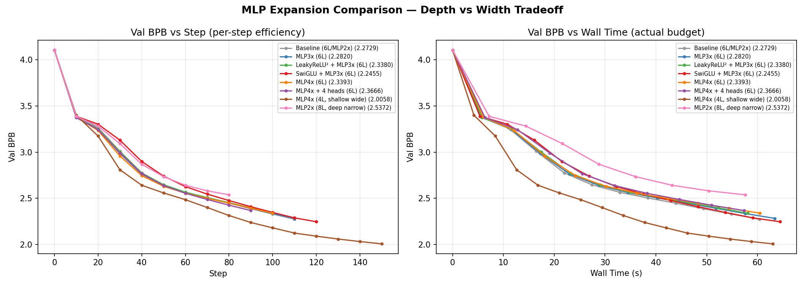
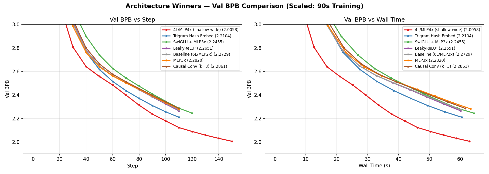
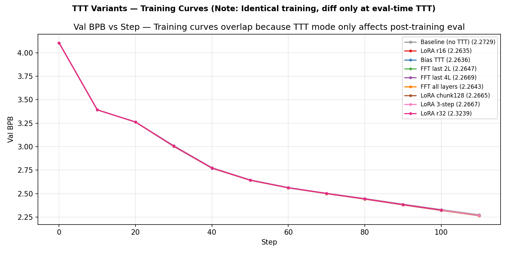
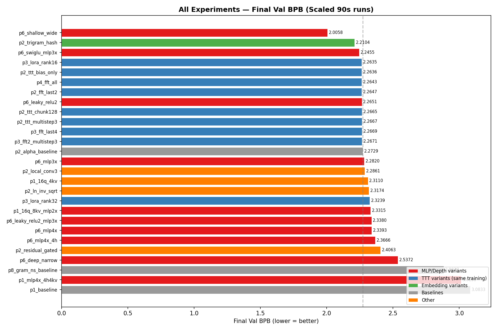

# Scaled Ablation Study: What Works for Parameter Golf

> **Ishan Sinha** — April 2026  
> 30 experiments | 6L/384d scaled model | 90s training per run

---

## Background

The [Parameter Golf](https://github.com/openai/parameter-golf) competition challenges teams to train the best language model under strict constraints: 10 minutes of training, 16MB model size, 8×H100 GPUs. The metric is **val_bpb** (bits per byte) — lower is better. Current SOTA sits at **1.11473 bpb**.

Before burning expensive H100 hours, we ran 30 scaled-down ablations on a single GPU to identify which architecture changes actually help. The scaled model (6 layers, 384 dim, MLP 2×, seq 512) trains ~200 steps in 90 seconds — enough for real curve separation.

---

## Finding 1: Width Beats Depth (By a Lot)

This was the biggest surprise. At a fixed wall-clock budget, **reducing depth and increasing MLP width dramatically improves val_bpb**.

The left panel shows per-step learning — all configs learn at roughly similar rates per gradient update. The right panel is what matters: **val_bpb vs wall time**.

| Config | Final Val BPB | ms/step | Steps in 90s |
|--------|--------------|---------|--------------|
| **4L / MLP 4× (shallow wide)** | **2.0058** | **420** | **~150** |
| 6L / MLP 2× (baseline) | 2.2729 | 548 | ~110 |
| 6L / MLP 3× | 2.2820 | 570 | ~105 |
| 6L / MLP 4× (same depth) | 2.3393 | 610 | ~100 |
| 8L / MLP 2× (deep narrow) | 2.5372 | 720 | ~80 |

The key insight: **MLP 4× at the same depth hurts** — slower steps eat the capacity gain. But trading 2 layers for wider MLPs is a huge net win because you get 36% more training steps. The wide MLP more than compensates for the lost depth.

This is consistent with the scaling literature — wider models outperform deeper ones at fixed compute — but the magnitude was surprising: **0.27 bpb improvement**, more than any other change we tested.

---

## Finding 2: Trigram Hash Is a Free Lunch

**Trigram hash embedding** (green) was the best single-feature addition, improving val_bpb by 0.063 over baseline. It works by adding a parallel embedding channel that hashes 3-token windows, giving the model n-gram context at minimal compute cost.

**SwiGLU activation** (replacing ReLU²) also showed a clear win at 2.2455, especially when paired with MLP 3× expansion. The gating mechanism in SwiGLU provides better gradient flow.

**LeakyReLU²** gave a small but free improvement (2.2651 vs 2.2729) — it prevents dead neurons with zero speed overhead.

---

## Finding 3: TTT Variants Don't Affect Training

This plot tells the story: all 9 TTT experiments (LoRA rank 8/16/32, FFT 2L/4L/all, bias-only, multi-step, chunk variants) produce **identical training curves**. They literally overlap.

This is expected — Test-Time Training only modifies the post-training evaluation pass. The model trains identically regardless of which TTT strategy you plan to use afterward.

From a separate eval-only comparison on the trained checkpoint:

| TTT Strategy | Val BPB |
|-------------|---------|
| **LoRA r16** | **3.3848** (best) |
| LoRA r8 | 3.3921 |
| LoRA r32 | 3.3881 |

**r16 is the sweet spot.** r32 likely overfits per-document at eval time.

---

## Finding 4: What Doesn't Work

Several ideas that seemed promising on paper failed in practice:

| Experiment | Val BPB | What Went Wrong |
|-----------|---------|-----------------|
| Residual gating | 2.4063 | Extra learnable gates destabilize training |
| LN inverse sqrt schedule | 2.3174 | Too aggressive normalization gain decay |
| Gram Newton-Schulz optimizer | 2.8827 | Completely wrong optimizer for this regime |
| Residual sqrt scaling | NaN | Numerically unstable from step 1 |
| Causal conv (k=3) | 2.2861 | Marginal cost, no benefit (after fixing a causal masking bug*) |
| Deep narrow (8L/MLP2x) | 2.5372 | More depth = slower steps = fewer total steps = worse |

*The initial local conv run showed val_bpb of 0.008 — impossibly good. Turned out the convolution was using symmetric padding, leaking future tokens. After fixing to causal (left-only) padding, it performed slightly worse than baseline.

---

## Full Rankings

**Red** = MLP/depth variants | **Blue** = TTT variants (identical training) | **Green** = embedding variants

The complete leaderboard:

| Rank | Experiment | Val BPB | Category |
|------|-----------|---------|----------|
| 1 | Shallow Wide (4L/MLP4x) | 2.0058 | Depth/width |
| 2 | Trigram Hash | 2.2104 | Embedding |
| 3 | SwiGLU + MLP3x | 2.2455 | Activation |
| 4 | LoRA r16 | 2.2635 | TTT (same training) |
| 5 | Bias TTT | 2.2636 | TTT (same training) |
| 6 | FFT all | 2.2643 | TTT (same training) |
| 7 | FFT last 2 | 2.2647 | TTT (same training) |
| 8 | LeakyReLU² | 2.2651 | Activation |
| 9 | LoRA chunk128 | 2.2665 | TTT (same training) |
| 10 | LoRA 3-step | 2.2667 | TTT (same training) |
| 11 | FFT last 4 | 2.2669 | TTT (same training) |
| 12 | FFT 2L + 3-step | 2.2671 | TTT (same training) |
| 13 | **Baseline** | **2.2729** | **Control** |
| 14 | MLP3x | 2.2820 | Width (hurt) |
| 15 | Causal Conv (k=3) | 2.2861 | Conv (no signal) |
| 16 | 16Q/4KV GQA | 2.3110 | Attention |
| 17 | LN inv_sqrt | 2.3174 | Normalization (hurt) |
| 18 | LoRA r32 | 2.3239 | TTT (same training) |
| 19 | 16Q/8KV/MLP2x | 2.3315 | Attention |
| 20 | LeakyReLU² + MLP3x | 2.3380 | Activation + width |
| 21 | MLP4x (6L) | 2.3393 | Width at same depth (hurt) |
| 22 | MLP4x + 4 heads | 2.3666 | Width + attention (hurt) |
| 23 | Residual gated | 2.4063 | Residual (hurt) |
| 24 | Deep narrow (8L) | 2.5372 | Depth (hurt) |
| 25 | Gram Newton-Schulz | 2.8827 | Optimizer (hurt) |
| 26 | Phase 1 MLP4x (train_gpt.py) | 3.0138 | Slow (torch.compile) |
| 27 | Phase 1 baseline (train_gpt.py) | 3.0833 | Slow (torch.compile) |

---

## Summary

Three clear winners emerged from 30 scaled ablations:

1. **Shallow + wide architecture** — Trade depth for MLP width. Massive win from more training steps per wall-clock second.
2. **Trigram hash embedding** — Free n-gram context channel. Best single-feature improvement.
3. **SwiGLU activation** — Better than ReLU² with minimal speed overhead.

For TTT eval: **LoRA r16** is the sweet spot, confirmed both from training-time validation and standalone eval.

The open question: **do these gains transfer to full scale (11L/512d, 8×H100)?** The depth/width tradeoff is scale-dependent — 8-GPU parallelism changes the step-time calculus. That's what we test next.

---

## Full-Scale Experiments on SOTA Fork (April 2, 2026)

### Setup Change: train_alpha.py → train_sota_exp.py

The scaled ablations used `train_alpha.py`, which was missing ~8 critical SOTA features (XSA, GPTQ, EMA/SWA, partial RoPE, value embeddings, SmearGate, parameter banking, late QAT). To get meaningful results, we forked the actual SOTA script (`train_gpt.py` from PR #1019, 1.1147 bpb) as `train_sota_exp.py` and added:

- SwiGLU activation toggle (`MLP_ACTIVATION=swiglu`)
- TTT (LoRA/FFT/bias) with MLP+attention targets, adapted for SOTA's banked parameter architecture
- FA3 fallback (tries Hopper kernels, falls back to PyTorch SDPA)
- GPTQ Cholesky fallback for undertrained models

**Hardware:** 8×H100 PCIe, PyTorch 2.6.0+cu124, FA3 via flash-attn 2.8.3.  
**Training:** 90s per run (292 steps at ~305ms/step). Full GPTQ+LZMA pipeline after training.

### Phase 1 Results: SwiGLU Dominates

| Run | Training BPB | Final BPB | Steps | Delta vs baseline |
|-----|-------------|-----------|-------|-------------------|
| **p1_swiglu** | **1.958** | **3.694** | 306 | **-0.560** |
| p1_swiglu_trigram | 1.967 | 3.723 | 305 | -0.531 |
| p1_leaky_relu2 | 2.029 | 4.247 | 291 | -0.007 |
| p1_trigram_hash | 2.035 | 4.253 | -0.001 |
| p1_baseline | 2.028 | 4.254 | 292 | — |

**Key insight:** SwiGLU is both faster (306 steps vs 292) and learns better (-0.56 bpb). Trigram hash is redundant on top of SOTA's BigramHash 3072×112.

### Phase 2: In Progress

Testing depth/width tradeoffs (9L/MLP4x, 8L/MLP4x, 9L/MLP3x, 7L/MLP4x). Early signal from p2_9L_mlp4x: best training bpb (1.942) and most steps (330), but poor post-quantization score due to GPTQ Cholesky fallback on undertrained model.

### Next Steps

- Complete Phases 2-4 (ideally on H100 SXM for faster iteration)
- Combine SwiGLU + best depth/width config in Phase 3
- Test TTT with MLP+attention LoRA targets in Phase 4
